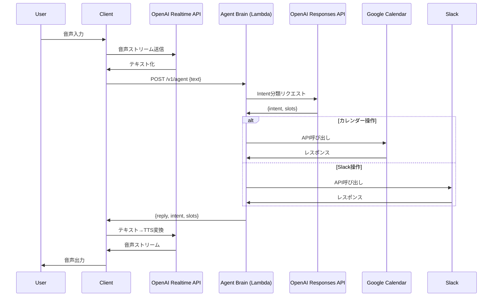

# パーソナル秘書エージェント v0 設計書

## 0. コンセプト

### 目的

音声でもテキストでも話しかけられる**パーソナル秘書エージェント**

以下の機能を提供する：
- 予定確認・予定作成（Googleカレンダー）
- Slackへのメッセージ送信・簡単なサマリ
- 雑談・一般質問
- タイマー・アラーム（ローカル or 外部）

### 非目的（v0では扱わない）

- 自作サービス（StellaMail / DevOps / ReserveHub）の操作
- 本番デプロイ・CIなどインフラ操作
- 複雑なマルチユーザー調整（会議参加者全員の空き時間検索など）

---

## 1. 全体アーキテクチャ

### 構成要素

#### クライアント
- **デバイス**: Raspberry Pi / PC / スマホアプリ
- **I/O**: 音声入出力（マイク・スピーカー）

#### OpenAI
- **Realtime API**: 音声ストリーミング（STT/TTS）
- **Responses API / Agents SDK**: Intent判定・思考

#### AWS
- **API Gateway**: `/v1/agent` エンドポイント
- **Lambda**: Agent Brain（Intentルーター＋ポリシー＋外部サービス連携）

#### 外部サービス連携
- Google Calendar Connector（自前 or MCP）
- Slack Connector（自前 or MCP）
- （必要なら）スマートホーム Connector

### 大まかなフロー



1. **音声入力** → Realtime API → テキスト化
2. **Realtimeクライアント**が `POST /v1/agent` にテキスト送信
3. **Lambda**:
   - LLM（Responses）で Intent + slots 抽出
   - Intentに応じて Google/Slack API を叩く
   - 最終的な返信テキストを生成
4. **返信テキスト**を Realtime API 経由で TTS → スピーカーから発話

---

## 2. Lambda API 仕様（Agent Brain）

### エンドポイント

```
POST /v1/agent
```

### リクエスト

```json
{
  "text": "明日の10時にミーティング入れて",
  "user_id": "yuya",
  "session_id": "optional-session-id"
}
```

**フィールド説明:**
- `text` (必須): ユーザー発話
- `user_id` (任意): ユーザー識別子（今は自分だけ想定でも、型は作っておく）
- `session_id` (任意): 会話セッションID（Realtime側から渡す）

### レスポンス

```json
{
  "ok": true,
  "intent": "ADD_EVENT",
  "slots": {
    "title": "ミーティング",
    "start": "2025-11-22T10:00:00+09:00",
    "end": "2025-11-22T10:30:00+09:00",
    "location": null
  },
  "reply": "明日の10時から30分のミーティングをカレンダーに入れておいたよ。",
  "meta": {
    "model": "gpt-4.1-mini",
    "tool_calls": [
      {
        "service": "google_calendar",
        "action": "create_event"
      }
    ]
  }
}
```

**フィールド説明:**
- `ok`: 処理成功フラグ
- `intent`: 判定されたIntent名
- `slots`: Intentに対応するパラメータ
- `reply`: ユーザーへの返答テキスト
- `meta`: 実行メタ情報（使用モデル、呼び出したツール）

---

## 3. Intent 設計（v0）

### 3.1 共通フォーマット

```typescript
type IntentName =
  | "SMALL_TALK"
  | "ASK_KNOWLEDGE"
  | "SET_TIMER"
  | "SET_ALARM"
  | "QUERY_SCHEDULE"
  | "ADD_EVENT"
  | "CANCEL_EVENT"
  | "SLACK_POST_MESSAGE"
  | "SLACK_SEND_DM"
  | "SLACK_SUMMARIZE_CHANNEL";

type IntentPayload = {
  intent: IntentName;
  slots: Record<string, any>;
};
```

### 3.2 Intent 詳細仕様

#### 1) SMALL_TALK

**用途**: 雑談・日常会話

**例**:
- 「今日は眠い」
- 「今なにしてたの？」

**動作**: 返信だけ、外部サービスなし

**Payload**:
```json
{
  "intent": "SMALL_TALK",
  "slots": {
    "free_text": "今日は眠い"
  }
}
```

---

#### 2) ASK_KNOWLEDGE

**用途**: 一般的な知識・質問への回答

**例**:
- 「型理論って何？」
- 「イタリアの首都は？」

**動作**: LLMで回答、外部サービスなし

**Payload**:
```json
{
  "intent": "ASK_KNOWLEDGE",
  "slots": {
    "question": "型理論って何？"
  }
}
```

---

#### 3) SET_TIMER

**用途**: タイマーのセット

**例**: 「3分タイマーセットして」

**Payload**:
```json
{
  "intent": "SET_TIMER",
  "slots": {
    "duration_seconds": 180,
    "label": "タイマー"
  }
}
```

**実装**:
v0ではクライアント側で実装でもOK（RPi側でカウントダウン）

---

#### 4) SET_ALARM

**用途**: アラームのセット

**例**: 「明日の7時にアラームセットして」

**Payload**:
```json
{
  "intent": "SET_ALARM",
  "slots": {
    "datetime": "2025-11-22T07:00:00+09:00",
    "label": "起床"
  }
}
```

**実装**:
v0では「カレンダーに"アラーム"イベントとして登録」でもよいし、クライアント側アラームでもよい。

---

### 3.3 Google Calendar Intent

#### 5) QUERY_SCHEDULE

**用途**: 予定の確認

**例**:
- 「今日の予定教えて」
- 「明日の午前って空いてる？」

**Payload**:
```json
{
  "intent": "QUERY_SCHEDULE",
  "slots": {
    "range_start": "2025-11-21T00:00:00+09:00",
    "range_end": "2025-11-21T23:59:59+09:00",
    "focus": "today"
  }
}
```

**Lambda → Google Calendar**:
```javascript
events.list({
  timeMin: range_start,
  timeMax: range_end,
  singleEvents: true,
  orderBy: "startTime"
})
```

---

#### 6) ADD_EVENT

**用途**: 予定の追加

**例**:
- 「明日の10時から30分、ミーティング入れて」
- 「来週火曜の午後に '歯医者' って予定いれといて」

**Payload**:
```json
{
  "intent": "ADD_EVENT",
  "slots": {
    "title": "ミーティング",
    "start": "2025-11-22T10:00:00+09:00",
    "end": "2025-11-22T10:30:00+09:00",
    "location": null
  }
}
```

**Lambda → Google Calendar**:
```javascript
events.insert({
  summary: title,
  start: { dateTime: start },
  end: { dateTime: end },
  location: location
})
```

---

#### 7) CANCEL_EVENT

**用途**: 予定のキャンセル（v0では簡易実装）

**例**: 「明日の10時のミーティングキャンセルして」

**v0の割り切り**:
- 同じ時間帯の予定が1件だけならそれをcancel
- 複数あれば「どれを消すか」聞き返す（→ v1）

**Payload**:
```json
{
  "intent": "CANCEL_EVENT",
  "slots": {
    "target_time": "2025-11-22T10:00:00+09:00",
    "title_keyword": "ミーティング"
  }
}
```

---

### 3.4 Slack Intent

#### 8) SLACK_POST_MESSAGE

**用途**: Slackチャンネルへの投稿

**例**: 「#random に『今日は在宅勤務します』って送って」

**Payload**:
```json
{
  "intent": "SLACK_POST_MESSAGE",
  "slots": {
    "channel": "#random",
    "message": "今日は在宅勤務します"
  }
}
```

**Lambda → Slack**:
```javascript
chat.postMessage({
  channel: channel,
  text: message
})
```

---

#### 9) SLACK_SEND_DM

**用途**: SlackでDM送信

**例**: 「田中さんに『あとで10分話せますか？』って送って」

**Payload**:
```json
{
  "intent": "SLACK_SEND_DM",
  "slots": {
    "user_display_name": "田中",
    "message": "あとで10分話せますか？"
  }
}
```

**実装メモ**:
Lambda側で `user_display_name` → Slack user ID 変換が必要
（v0は固定マッピングテーブルでもOK）

---

#### 10) SLACK_SUMMARIZE_CHANNEL

**用途**: Slackチャンネルの要約

**例**: 「#backend の今日の流れざっくり教えて」

**Payload**:
```json
{
  "intent": "SLACK_SUMMARIZE_CHANNEL",
  "slots": {
    "channel": "#backend",
    "range_hours": 12
  }
}
```

**処理フロー**:
1. Lambda → Slack API で直近メッセージ取得
2. 取得したメッセージをLLMで要約

---

## 4. Intent 判定（classifyIntent）

### 入出力

**入力**:
- `text`: ユーザー発話
- `user_id`: ユーザーID

**出力**:
- `IntentPayload`: {intent, slots}

### 使用API

OpenAI Responses API（gpt-4.1-mini 想定）

### プロンプト方針（ざっくり）

**system プロンプト**:
- このエージェントが「パーソナル秘書」であること
- 上記 Intent 一覧と slots 仕様を列挙
- `response_format: json_object` で
  `{"intent": "...", "slots": {...}}` 以外の出力は禁止と明記

**例**:
```
あなたはパーソナル秘書エージェントです。
ユーザーの発話から、以下のIntentのいずれかに分類し、
必要なslots（パラメータ）を抽出してください。

Intent一覧:
- SMALL_TALK: 雑談
- ASK_KNOWLEDGE: 知識・質問
- QUERY_SCHEDULE: 予定確認
- ADD_EVENT: 予定追加
...

出力は必ずJSON形式で、以下の構造にしてください:
{
  "intent": "INTENT_NAME",
  "slots": { ... }
}
```

---

## 5. Lambda 内部構造

### handler.ts

```typescript
export const handler = async (event: APIGatewayProxyEvent) => {
  const body = JSON.parse(event.body ?? "{}");
  const text = body.text;
  const userId = body.user_id;

  // Intent判定
  const intentPayload = await classifyIntent(text, userId);

  // Intent実行
  const reply = await handleWithTools(intentPayload, userId);

  return {
    statusCode: 200,
    body: JSON.stringify({
      ok: true,
      intent: intentPayload.intent,
      slots: intentPayload.slots,
      reply,
    }),
  };
};
```

### handleWithTools の責務

Intent → 各サービスコールの振り分け

```typescript
async function handleWithTools(
  intent: IntentPayload,
  userId: string
): Promise<string> {
  switch (intent.intent) {
    case "SMALL_TALK":
      return await replySmallTalk(intent.slots);

    case "ASK_KNOWLEDGE":
      return await replyKnowledge(intent.slots.question);

    case "SET_TIMER":
      // v0: クライアント側に任せるのでメッセージだけ返す
      return `タイマーを ${intent.slots.duration_seconds} 秒でセットして。`;

    case "QUERY_SCHEDULE":
      const events = await calendar.listEvents(userId, intent.slots);
      return formatScheduleReply(events, intent.slots);

    case "ADD_EVENT":
      await calendar.addEvent(userId, intent.slots);
      return "カレンダーに予定を入れておいたよ。";

    case "CANCEL_EVENT":
      await calendar.cancelEvent(userId, intent.slots);
      return "予定をキャンセルしておいた。";

    case "SLACK_POST_MESSAGE":
      await slack.postMessage(userId, intent.slots);
      return `Slack にメッセージ送っておいた。`;

    case "SLACK_SEND_DM":
      await slack.sendDM(userId, intent.slots);
      return `DMを送っておいた。`;

    case "SLACK_SUMMARIZE_CHANNEL":
      const summary = await slack.summarizeChannel(userId, intent.slots);
      return summary;

    default:
      return "すみません、よくわかりませんでした。";
  }
}
```

---

## 6. 安全性・制限（v0 方針）

### 破壊的操作の範囲

v0で実行可能な破壊的操作:
- カレンダー削除（CANCEL_EVENT）
- Slack 投稿

### v0ルール

#### CANCEL_EVENT
- **日時＋タイトルキーワード**で一意に特定できる場合のみ実行
- それ以外は「対象が特定できない」と返す

#### Slack 投稿
- 送信先は**許可されたチャンネルのみ**（#random, #dev 等ホワイトリスト）
- ホワイトリスト外への投稿は拒否

#### DevOps/インフラ操作
- v0の仕様から外したので、そのIntentは作らない

---

## 7. ログ

### 出力先

CloudWatch Logs

### ログ項目（最低限）

- `timestamp`: タイムスタンプ
- `user_id`: ユーザーID
- `text`: ユーザー発話
- `intent`: 判定されたIntent
- `slots`: Intent パラメータ（**機密情報・トークンは除く**）
- `service`: 呼んだサービス（calendar/slack）
- `error`: エラー内容（発生時のみ）

### ログ例

```json
{
  "timestamp": "2025-11-21T10:30:00Z",
  "user_id": "yuya",
  "text": "明日の10時にミーティング入れて",
  "intent": "ADD_EVENT",
  "slots": {
    "title": "ミーティング",
    "start": "2025-11-22T10:00:00+09:00",
    "end": "2025-11-22T10:30:00+09:00"
  },
  "service": "google_calendar",
  "action": "create_event",
  "status": "success"
}
```

---

## 8. v0 で「できるようにすること」チェックリスト

- [ ] 1. 「今日 / 明日 / 来週の予定どうなってる？」
       → Googleカレンダーから読み上げ
- [ ] 2. 「明日の10時にミーティング入れて」
       → カレンダーに予定作成
- [ ] 3. 「明日の10時のミーティングキャンセルして」
       → 該当予定を削除
- [ ] 4. 「#random に『今日は在宅で作業します』って送って」
       → Slack投稿
- [ ] 5. 「#backend の今日の流れざっくり教えて」
       → Slackメッセージ要約
- [ ] 6. タイマー・アラームの簡単な指示
       → テキストとして返す（v0ではクライアント側実装）

---

## 9. 次のステップ（実装に向けて）

設計書がまとまったので、次は以下のいずれかから実装を進める：

### A. Intent判定用プロンプトの実テキスト

- システムプロンプトの詳細版作成
- few-shot examples の準備
- response_format 定義

### B. Google Calendar / Slack 向けの「実APIインターフェース定義」

- 各サービスの認証方法
- APIクライアントのインターフェース定義
- エラーハンドリング仕様

### C. LambdaをCDKで生やすスタック定義

- CDK構成
- API Gateway + Lambda の設定
- 環境変数・シークレット管理
- CloudWatch Logs 設定

---

## 付録: アーキテクチャ判断の経緯

### なぜ「完全SaaS」ではなく「Lambda + OpenAI」か

#### 汎用SaaS型AIエージェントプラットフォーム（Zapier AI, n8n, Voiceflowなど）

**メリット**:
- ノーコードで形にはなる
- プロンプト・フロー管理UIが最初からある

**デメリット**:
- DevOps系やローカルネット内のマシン（Raspberry Pi）を扱い出すと一気に不便
- セキュリティ・権限周りが「サービス都合」になる
- 日本語音声＋自前デバイス＋MCP みたいな構成は想定されていない

#### クラウドベンダーのエージェント機能（AWS Bedrock Agents, Azure AI Agentなど）

**メリット**:
- IAM / VPC / 監査ログなど、クラウドネイティブなセキュリティがっちり
- AWSのリソース操作は超得意

**デメリット**:
- OpenAI Realtime + MCP の世界観と直接は繋がらない
- 「家の中のRaspberry Pi」「自作MCPサーバ」との連携は結局自分でごりごり書く
- 日本語の雑多な日常コマンド＋自作サービス全部、というより「業務ワークフロー向き」

### 採用した構成: Lambda（自前Brain）+ OpenAI（思考エンジン）

**OpenAIに任せる部分**:
- モデルそのもの（GPT系）
- エージェント思考・ツール呼び分けの基礎ロジック（Responses / Agents SDK）
- 音声処理（STT/TTS＋ストリーミング）：Realtime API
- （余裕が出たら）フロー編集UI：Agent Builder / AgentKit

**自前で握る部分**:
- Brain API（Lambda `/v1/agent`）
- 誰が呼べるか（認証）
- Intentごとの許可・禁止
- ツールのホワイトリスト
- 「確認が必要な操作かどうか」
- MCPサーバ群
  - StellaMail / DevOps / SmartHome / ReserveHub
  - 実際に破壊的なことをするのはここだけに閉じ込める

この構成により、**エージェントの"フレームワーク"は既存サービス（OpenAI）に乗っかりつつ、"何ができるか""どこまで許可するか"は自分でLambda + MCPで握る**というハイブリッドを実現する。

---

**Document Version**: v0.1
**Last Updated**: 2025-11-20
**Author**: yuya
